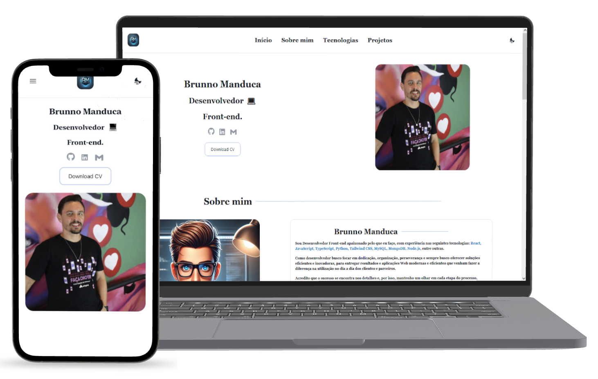

# 👨🏻‍💻 Website Portfólio Pessoal

## 📚 Descrição do projeto
A idéia inicial desse projeto, foi desenvolver um portfólio pessoal para que eu pudesse divulgar e deixar mais presente para a comunidade a minha profissão como **Desenvolvedor Front-End**.
Dentro deste projeto é possível encontrar um pouco sobre informações pessoais sobre minha pessoa, como também tecnologias que tenho contato no meu dia-a-dia e os projetos que desenvolvi.
O Website em si, foi desenvolvido apartir da ferramenta **Vite** em conjunto com as tecnologias **React**, **Typescript** e **Tailwind CSS**.

## 🚀 Dando start ao projeto 
1. Inicialemnte é precido clonar este repositório do projeto.
2. Em seguida baixar e instalar as dependências do projeto, através do comando **npm install** ou **npm i**.
3. Rodar o projeto, através do comando **npm run dev**.
4. Navegar no link http://localhost:5173/, para visualizar o projeto em si.

## 💻 Tecnologias

## Licença
MIT License © [MIT License](./LICENSE)